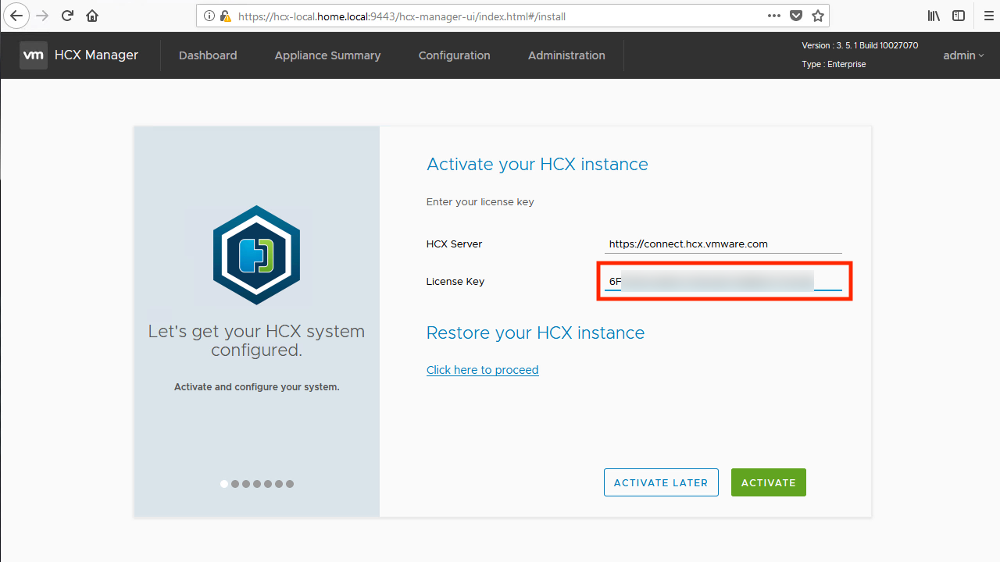
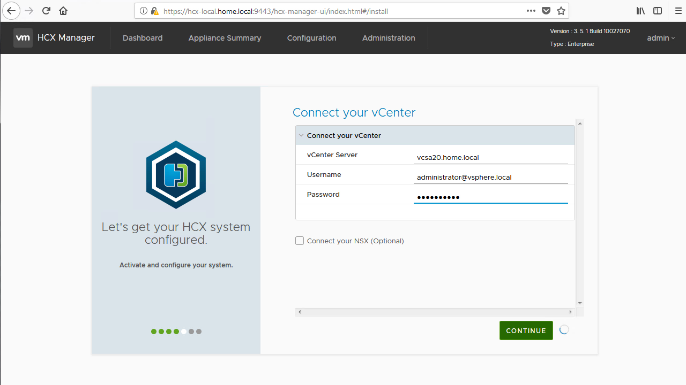
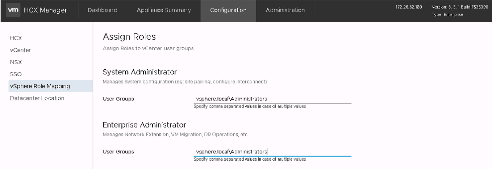
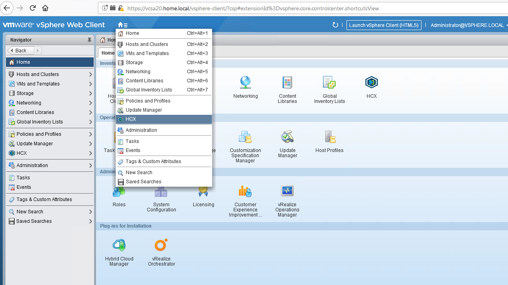
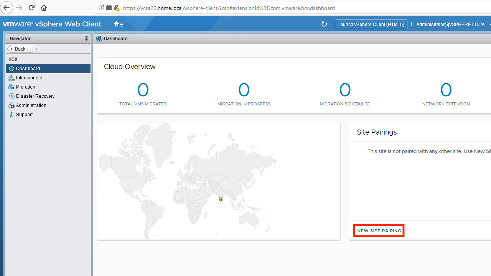
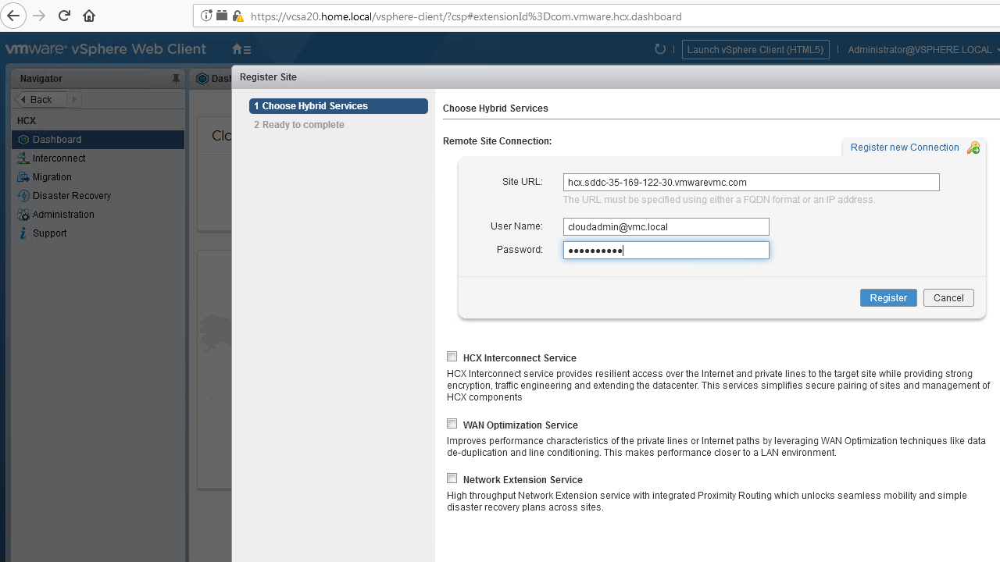
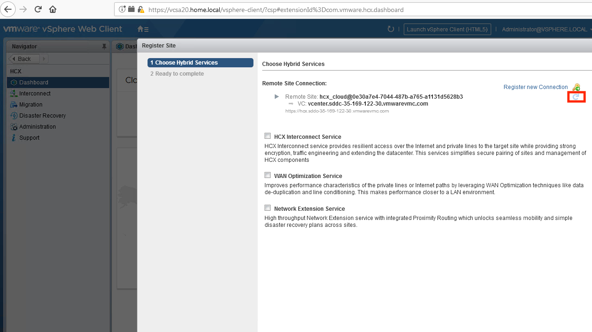

# HCX Manager Installation
The installation of the on-premises HCX Manager is summarized below. It is a required component.

### Installation Procedure
1. Deploy the ova to the on-premises vCenter. Note that you must use a Datastore for the appliance and not a Datastore Cluster. Also note that the "prefix length" used for the management IP is expected to be in CIDR format (i.e. 24 for a /24 network). Keep note of the passwords provided during installation. These will be used for logging into the appliance later on.

2. Connect to the web UI of the on-premises HCX appliance. Use the IP address provided to the manager during installation and connect via https (it should redirect to 9443). Log in using the passwords provided during installation. Note that it may take 5-10 minutes to come up after the initial installation.

3. Provide the activation key acquired from the cloud-side HCX Manager.
 

4. Configure HCX manager with the location of the on-premises network by entering a city name. Finish up by specifying the system name for the manager. Select "YES, CONTINUE" to continue with the setup.

5. Enter the admin credentials of the local vCenter. You may optionally provide credentials for your NSX manager, if applicable. Be sure to specify the FQDN for both. Following this, you will be asked to specify your SSO/PSC source. Restart the appliance when finished.
 

6. HCX will install UI components within vCenter. In order to see these, you must ensure that role mapping has been completed. Configure this from the on-premises HCX Manager.
 

7. From the HCX Manager, navigate to Administration -> Certificate-> Trust CA Certificate. Click on "import" and select "URL". Import the certificate for the SDDC HCX Manager by entering its URL (https://fqdn.of.hcx.manager). 

8. If logged into vCenter, then log out. After logging back into vCenter, you will find that HCX has installed components within the vCenter UI.

9. From the "home" menu on the top navigation of vCenter, open HCX.
 

10. Click on the New Site Pairing link on the dashboard, then Register new connection.
 

11. Enter the FQDN of the SDDC HCX Manager and the cloudadmin@vmc.local account and password from the SDDC. Do not install any additional services at this time.
 

12. Registration may take a few moments. You may hit the refresh button periodically to check the status of the registration.
 

---
[Top](./README.md) | [Back <- Prerequisite and Requirements](./02_prereqsAndRequirements.md) | [Next -> WAN Interconnect Appliance Installation](./04_ixInstallation.md)
