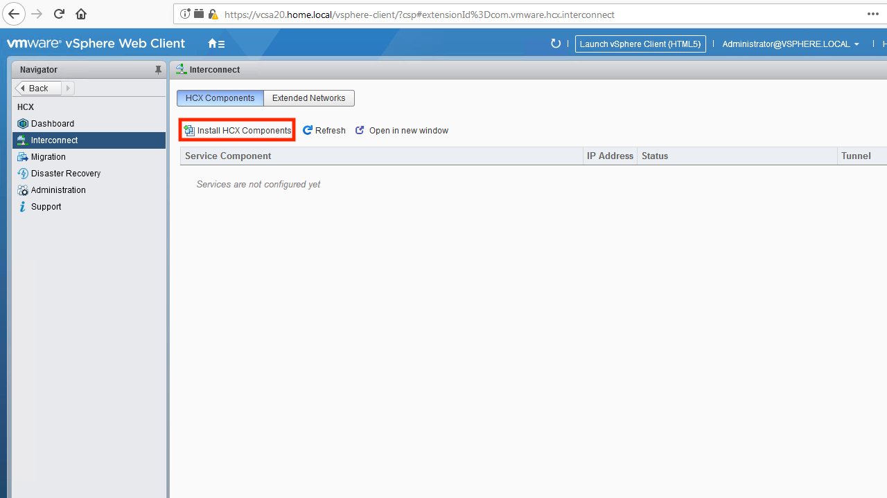
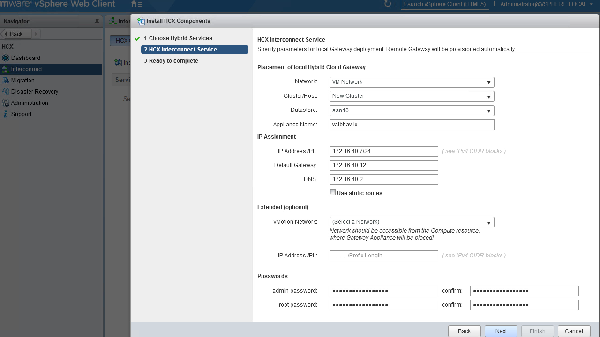
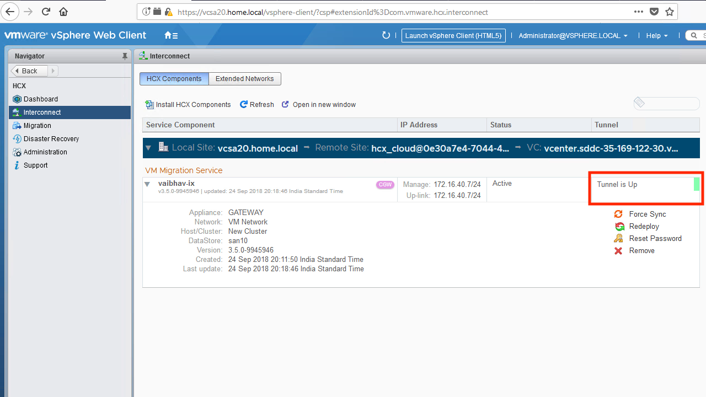

# WAN Interconnect Appliance Installation
The WAN Interconnect Appliance enables workload replication between sites. It is a required component.

### Installation Procedure
1. From vCenter, navigate to the HCX dashboard. Click on Interconnect -> Install HCX Components. Choose the HCX Interconnect Service from the list of services and hit "next".
 

2. Provide the storage and network properties for the appliance, as well as the passwords. Note that if your vMotion network is not accessible from the management network, then you must provide the appliance with a direct presence on the vMotion network.
 

3. Finish the install to deploy the appliance. Note that a matching appliance will be automatically installed within the SDDC. Once both are up and ready, then they will establish a tunnel between one another. If the tunnel fails to come up, then the most common culprit is a firewall blocking the connectivity.
 

---
[Top](./README.md) | [Back <- HCX Manager Installation](./03_mgrInstallation.md) | [Next -> WAN Optimization Appliance Installation](./05_wanOptInstallation.md)
