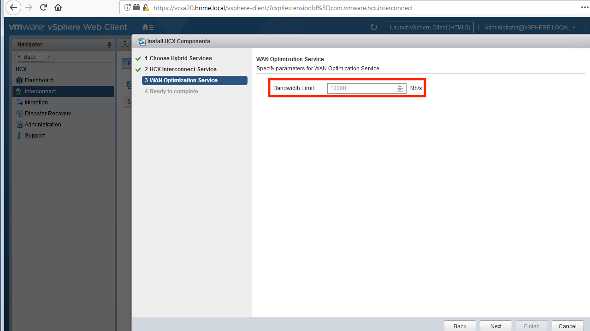

### WAN Optimization Appliance
The WAN Optimization Appliance installs as an optional companion component to the WAN Interconnect Appliance. Although it is optional, it is recommended.

### Installation Procedure
1. From vCenter, navigate to the HCX dashboard. Click on Interconnect -> Install HCX Components. Choose the WAN Optimization Service from the list of services and hit "next".
 

2. You may specify a bandwidth limit for replication as part of the appliance install. Hitting next will complete the installation and deploy a matching appliance in the SDDC.
 

---
[Top](./README.md) | [Back <- WAN Interconnect Appliance Installation](./04_ixInstallation.md) | [Next -> WAN Extension Appliance Installation](./06_l2cInstallation.md)
