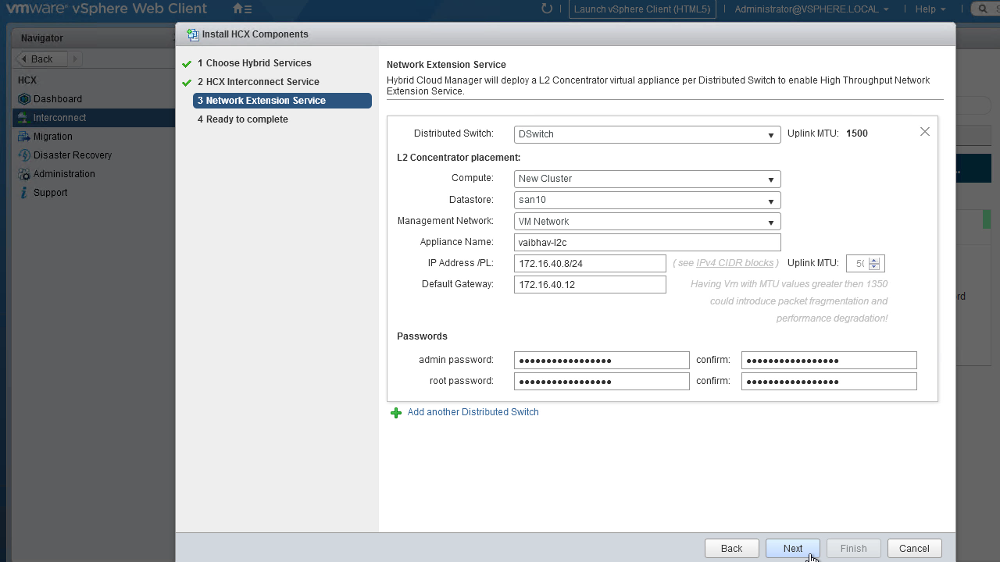
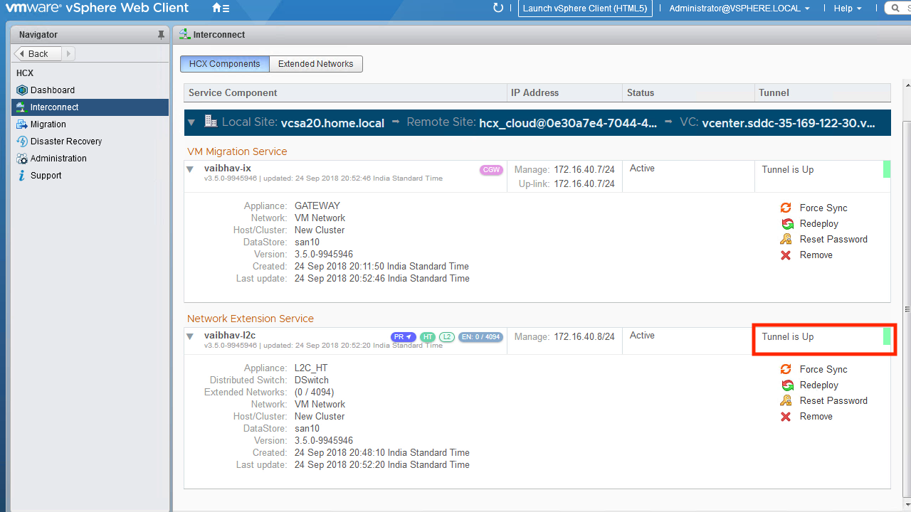

# WAN Extension Appliance Installation
The WAN Extension appliance enables port-groups of a VDS to be extended to the SDDC. It is optional unless network extension is a requirement.

### Installation Procedure
1. From vCenter, navigate to the HCX dashboard. Click on Interconnect -> Install HCX Components. Choose the Network Extension Service from the list of services and hit "next".
 

2. Provide the VDS which contains port-groups to be extended to the SDDC. Be sure to keep the uplink MTU at the default value of 1500. Provide the storage and network properties for the appliance, as well as the passwords.
 

3. Finish the install to deploy the appliance. Note that a matching appliance will be automatically installed within the SDDC. Once both are up and ready, then they will establish a tunnel between one another. If the tunnel fails to come up, then the most common culprit is a firewall blocking the connectivity.
 

---
[Top](./README.md) | [Back <- WAN Optimization Appliance Installation](./05_wanOptInstallation.md) | [Next -> Network Extension](./07_networkExtension.md)
