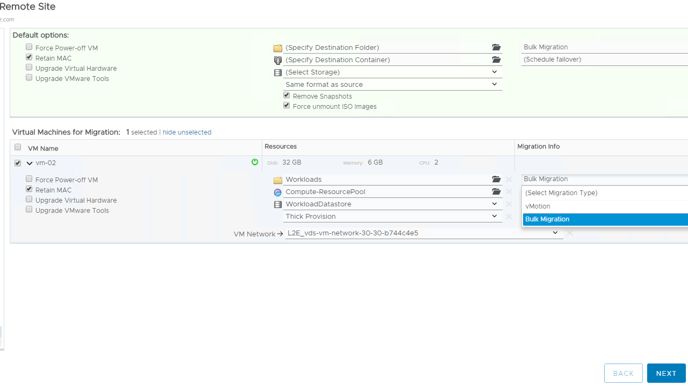

# Workload Migration
Workload migration in HCX comes in the following flavors:
* Bulk Migration - AKA "warm migration" or "reboot to cloud". Performed using the migration scheduler feature of HCX. Will pre-replicate data in advance of the migration and, at the preset time, will perform a final sync before shutting down (and archiving) the source VM and powering-up the migrated version in the destination site.
* vMotion - Replicates and migrates the source VM immediately. This performs similarly to vMotion built natively into vCenter.
* Cold Migration - A method for replicating powered-off VMs to the destination site.
* Replication-Assisted vMotion - Combines the features of Bulk Migration (scheduling, etc..) with vMotion (zero downtime).

You may find more information on the different types of migrations in the HCX [user guide](https://docs.vmware.com/en/VMware-NSX-Hybrid-Connect).

### Performing a Migration
Migrations are typically performed from the HCX dashboard within vCenter, by navigating to the Migration tab and clicking Migrate Virtual Machines. The following screenshot shows an example of the dialog.

---
[Top](./README.md) | [Back <- Network Extension](./07_networkExtension.md) | [Next -> Network Cutover](./09_networkCutover.md)
