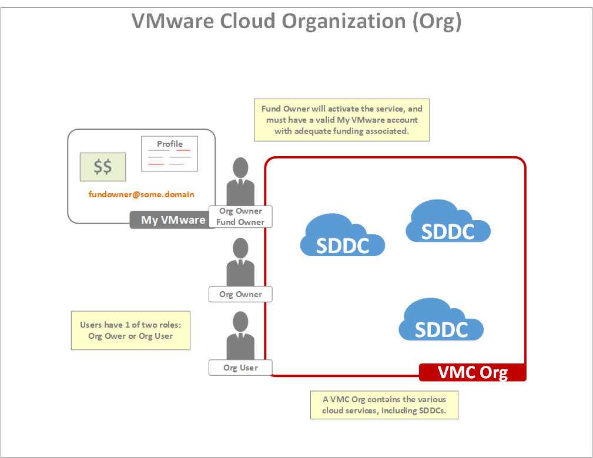
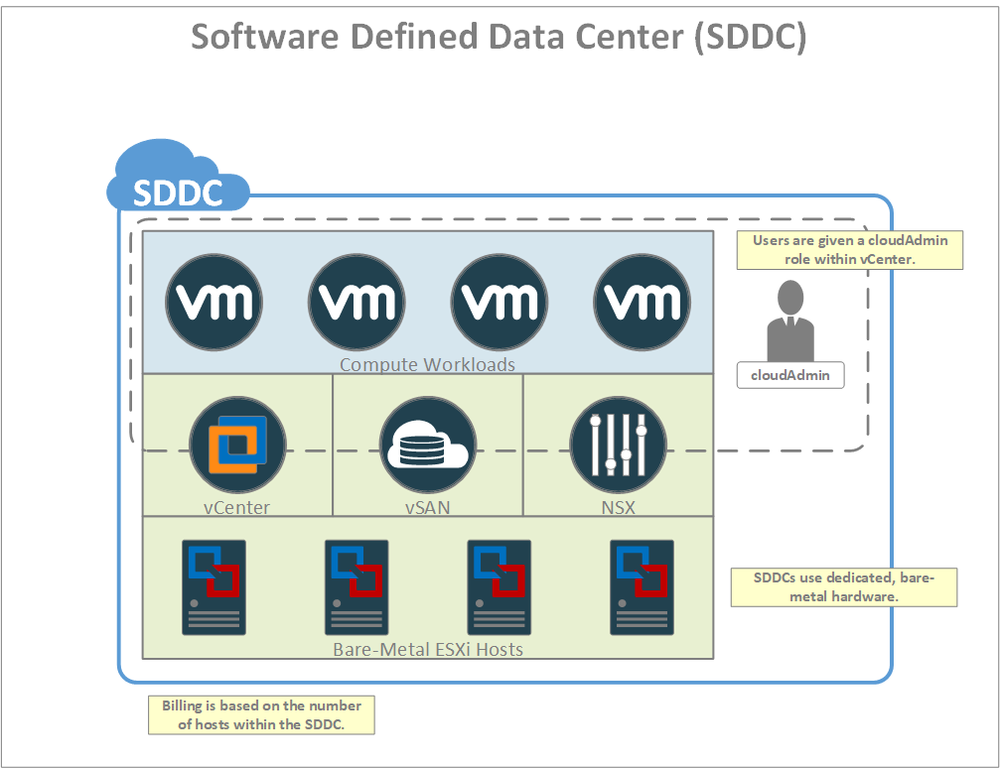
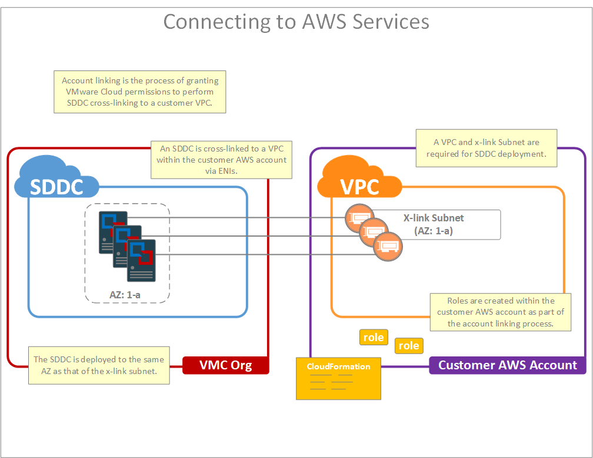

# Basic Concepts

### Amazon Web Services Account

A major benefit of the service is its ability to provide direct access to AWS services. As such, it is required that all customers maintain a dedicated AWS account which will be used to access and manage these services.  If you are unsure of how to create an AWS account, then please refer to the [AWS Documentation](https://aws.amazon.com/premiumsupport/knowledge-center/create-and-activate-aws-account/) for more information on the process.

A few important points on the AWS account:

* The account provides access to AWS services from a customer's VMware Cloud resources, and is required in order to deploy an SDDC.
* The account is owned by the customer, not by VMware.
* Billing for the account is handled directly by AWS, not by VMware

    
    
### The Cloud Services Organization

The cloud services Organization may be thought of as a top-level construct within [VMware Cloud](https://cloud.vmware.com). In the context of this specific service, it may be thought of as the object which contains SDDCs.

Within VMware Cloud, exist the the notion of users. Users are associated with 1 or more Orgs and, within each Org, a user will have 1 of 2 roles :

* Org User - has the ability to manage SDDCs and other cloud services to which they have been granted access.
* Org Owner - has the additional ability to manage users within the org.

It is important to note that users are only relevant within the VMware Cloud Services console. They do not reflect user accounts within an individual SDDC.

An Org must be fully funded prior to activation of the service, and the funding of an Org is done through a My VMware account. The person responsible for funding, known as the Fund Owner, will use their My VMware account to provide funding to the Org. When the Fund Owner signs up for the service, they will receive an email containing a single-use activation link. Clicking this link will trigger the creation of an Org and will automatically add the Fund Owner as an Org Owner within the newly created Org.

It is important that the Fund Owner have all required fields of their My VMware account profile fully populated and that they have adequate funds associated with that profile. This is a requirement in order to activate the service.  It is also important to note that the email address used for account activation is the one provided within the Fund Owner's My VMware profile. Therefore, it is very important that this email address be that of a recipient who is prepared to handle the activation email.

Key points to remember:
* An Org is a top-level construct which owns one or more SDDCs
* Users are associated with an Org and have one of two roles: Org Owner and Org User
* Users exist within VMware Cloud Services console only, not within vCenter.
* Special user, Fund Owner, which will fund/activate the Org and add other users
* Fund owner must have valid My VMware profile (all required fields populated)
* Ensure that Fund Owner has a valid email address or the activation email may be lost

Please refer to the [User Guide](https://docs.vmware.com/en/VMware-Cloud-on-AWS/services/com.vmware.vmc-aws.getting-started/GUID-3D741363-F66A-4CF9-80EA-AA2866D1834E.html) for more information on creating and managing the cloud services Org.

### The Software Defined Data Center

The Software Defined Data Center (SDDC) is a collection of bare-metal hosts which are installed with a standard set of VMware software. It is important to understand that each SDDC is running atop dedicated hardware and that billing for an SDDC is based upon the number of hosts dedicated to the SDDC and not the number of VMs running within the SDDC.

Since VMware Cloud On AWS is a managed service, full admin-level access to the SDDC is not permitted. This restriction is in place to prevent customers from modifying the infrastructure of the SDDC itself.  Instead, customers are given a role which allows them to fully manage workloads which they have deployed within the SDDC. Normally, this permissions model does not impact day-to-day use of the service, however, it important to keep in mind if you are planning on integrating tools directly with infrastructure components such as vCenter. If the integration you are planning requires admin rights, then it may not function properly.

Key points to remember:
* Deployed upon dedicated, bare-metal hosts.
* Deployed with standard components (ESXi, vCenter, NSX, vSAN).
* Billing is based on the number of hosts within the SDDC, not on the number of VMs.
* Users have the ability to manage their workloads, and have limited access to vCenter,vSAN, and NSX.

### The Connection to AWS Services

Each SDDC is provided direct access to AWS services via a connection to a customer-owned AWS account. This connection is established as part of the SDDC provisioning process, and is performed using one of two methods:

* By choosing an AWS account which has previously been connected to another SDDC, or
* By creating a new connection to an AWS account

The term "connected" simply means that the customer has granted permissions for the VMware Cloud On AWS service to enable routing between an SDDC and a [VPC](https://docs.aws.amazon.com/AmazonVPC/latest/UserGuide/VPC_Subnets.html) within the customer-owned AWS account. These permissions are granted via [IAM](https://aws.amazon.com/iam/) roles which are created within the connected account using a [CloudFormation](https://aws.amazon.com/cloudformation/) template. It is important to note that the person who is performing the account connection process must have sufficient permissions (eg. admin rights) within the AWS account to execute this CloudFormation template.

Key points to remember:
* AWS services are managed through a customer-owned AWS account.
* Account linking enables VMware Cloud services to cross-link SDDCs into a customer-owned AWS account.
* Account linking is performed when the user executes a CloudFormation template within their AWS account.
* The CloudFormation template creates roles which enable VMware to manage SDDC cross-linking.
* Each SDDC is cross-linked to VPC/Subnet via a series of ENIs.
* The [Availability Zone](https://docs.aws.amazon.com/AWSEC2/latest/UserGuide/using-regions-availability-zones.html) (AZ) of the x-link Subnet will determine AZ of the SDDC.

Once a connection is established to the AWS account, it then becomes possible to configure a cross-link between an SDDC and a VPC within that account. The cross-link itself consists of a series of [Elastic Network Interfaces](https://docs.aws.amazon.com/AWSEC2/latest/UserGuide/using-eni.html) (ENI) which are attached to a Subnet within the VPC. It is these ENIs which provide the hosts of an SDDC with a network forwarding path to resources within the account. The topic of SDDC cross-linking will be explored in more detail later on, but for now it is important to keep the following considerations in mind when selecting a VPC/Subnet for the cross-linking:

* The VPC must exist within the same Region which is planned to house the SDDC.
* The Subnet must be sufficiently large to accommodate one ENI per host within the SDDC. Typically, a /26 is the minimum recommended size for the Subnet.
* Subnets are associated with an Availability Zone (AZ), therefore the choice of Subnet determines the Availability Zone into which the SDDC hardware is provisioned. The purpose of this is to avoid cross-AZ bandwidth charges between the SDDC and the Subnet used for cross-linking (see AWS [billing policies](https://aws.amazon.com/govcloud-us/pricing/data-transfer/) for details).
* It is recommended to use a dedicated Subnet for cross-linking. The purpose of this is to ensure that IP addresses within the Subnet are not consumed by other services (e.g. other EC2 instances) thus preventing ENIs for new hosts from being added as the SDDC grows. Secondary to that, using a dedicated Subnet helps prevent the situation where an AWS admin accidentally deletes or otherwise modifies the ENIs used for cross-linking.
* It is possible to cross-link multiple SDDCs to the same AWS account. If you plan to do this, then it is vital to ensure that you do not create IP addressing conflicts by using overlapping IP address ranges between the SDDCs. This is particularly relevant if you plan to cross-link multiple SDDCs to the same VPC.

#### [Top](./README.md) | [Next -> Compute and Storage](./02_computeAndStorage.md)
