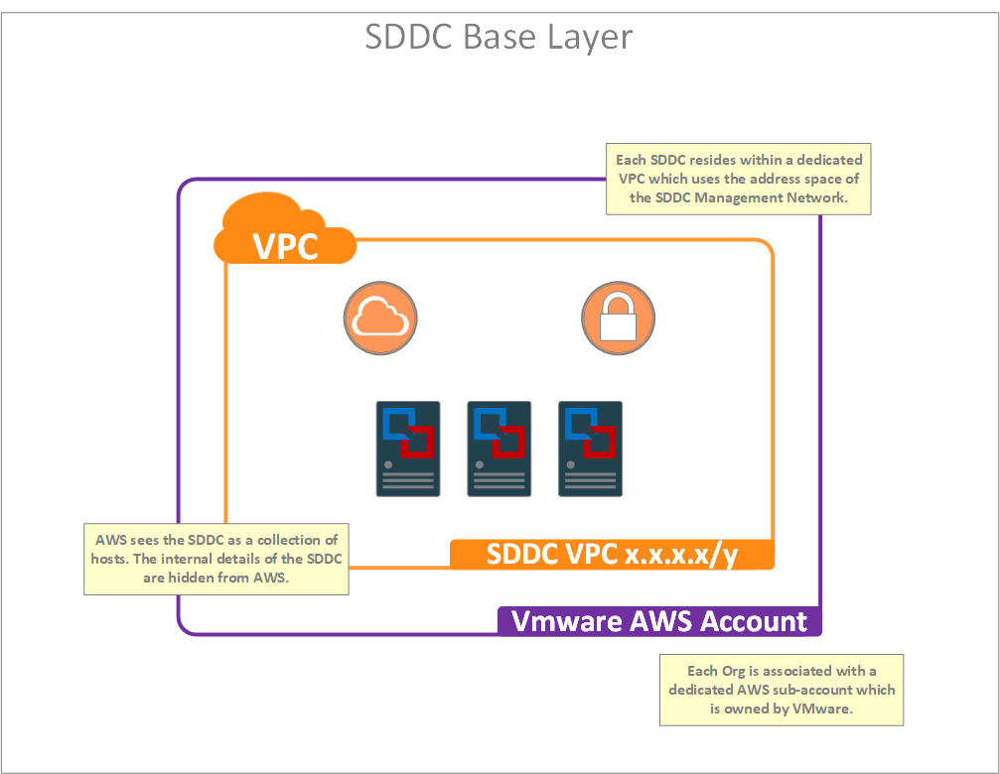
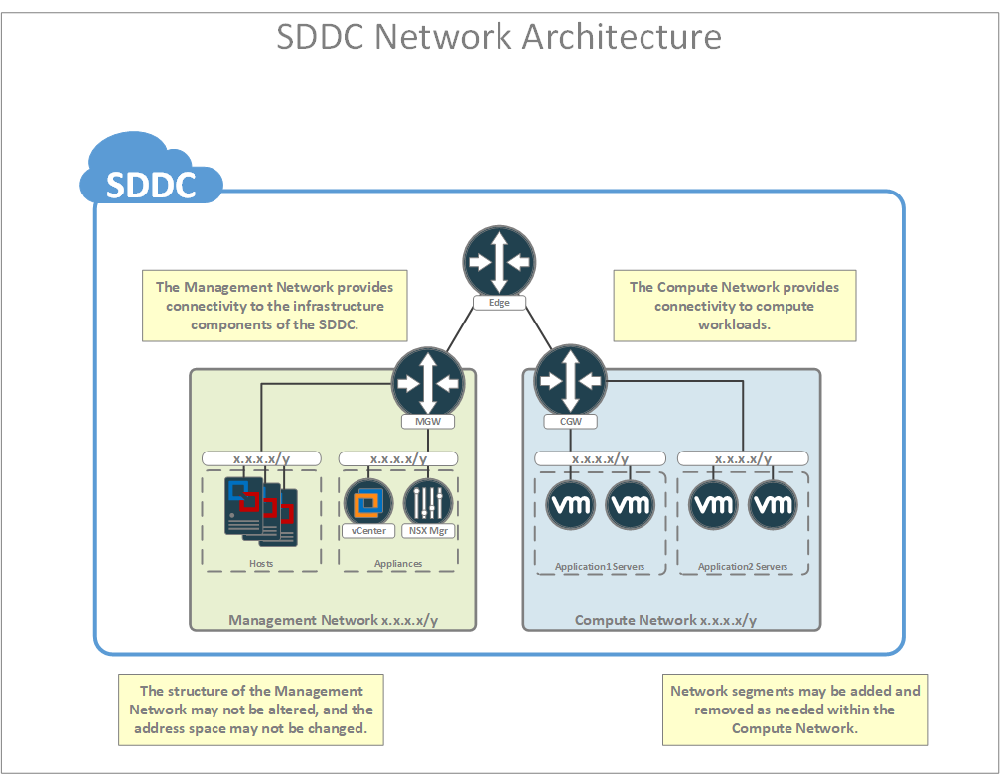
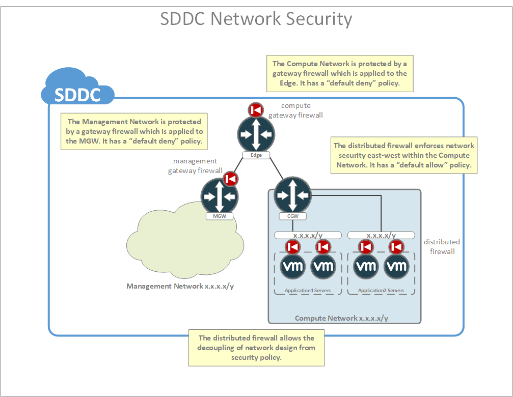

# SDDC Networking

### An SDDC as Viewed by AWS
The diagram below illustrates the view of the SDDC from the perspective of AWS.

Despite the fact that the hosts of the SDDC are bare-metal hardware, the AWS infrastructure treats them as if they were EC2 instances. This means that the hosts themselves are tied to an AWS account, and that their networking stack is based upon the VPC technology used within AWS. The AWS account which is used for the hosts of the SDDC is one which is owned by VMware, but is dedicated to the VMC Org which contains the SDDC.

Per the diagram, each SDDC resides within a dedicated VPC which is owned by this AWS account. As with EC2, the hosts of the SDDC use the Internet Gateway for their public connectivity and the Virtual Private Gateway for access to Direct Connect Private VIF.

### SDDC Overlay Logical Network Design
Once the hosts of the SDDC have been provisioned, VMware builds the SDDC in such a way as to abstract the details away from the underlying AWS infrastructure.
The end result is an overlay network which is design as follows:

Here, we can see that the overlay network of the SDDC has 2 levels of routing. At the top level is an NSX tier-0 router which acts as the north-south border device for the entire SDDC. Below that are the NSX tier-1 routers, known as the Management Gateway (MGW) and Compute Gateway (CGW), which act as the gateways for the management and compute networks respectively.

Internally, the SDDC is utilizing NSX as a means of abstracting its private networks away from the underlying VPC. This abstraction provides the SDDC with additional functionality not normally available to native AWS workloads.

As indicated by the diagram, the Management Network is used by the infrastructure components of the SDDC. Due to the permissions model of the service, the layout of this network may not be altered. The Compute Network, on the other hand,  is used by the compute workloads of the SDDC. Within this network, customers have the ability to add and remove network segments as needed. It should be noted that there is a limit of 1024 logical ports within an NSX logical network. This limits the number of VMs which may be attached to a given network segment. Effectively, this means that segments should not exceed a /22.

### Network Security
Network security within an SDDC is implemented using 2 layers of firewalling: the NSX Gateway Firewall, and the NSX Distributed Firewall.

Gateway firewalling is designed to protect the north-south borders of the SDDC, and is implemented in 2 places. For the the Management Network gateway firewalling is implemented at the uplink interface of the mgw. Per the permissions model of the service, users are restricted on which services may be exposed through the management gateway firewall. For the Compute Network, gateway firewalling is enforced at the uplink interface of the edge. Users have full permissions to dictate security policy of the gatewy firewalling for the Compute Network.

The gateway firewalls have a “default deny” policy, which means that access must be specifically permitted. This applies to both inbound and outbound traffic. This means that in order to initiate communications outbound from the SDDC, the firewall policy must be configured to explicitly permit the connectivity.

Just as the Gateway Firewall is designed to protect the north-south boundary of the SDDC, the Distributed Firewall is designed to filter east-west traffic within the SDDC itself. The Distributed Firewall may be thought of as a centrally-managed, transparent, in-line firewall which protects all workloads within the Compute Network. Its purpose is to enable the administrator to enforce network security at the absolute edge of the network.

In a traditional network, security is enforced by a centralized appliance. This means that, typically, the subnets of a network are designed to reflect application logic.
This is seen in the example, with separate subnets which are designed to isolate the 2 tiers of an application. With the Distributed Firewall, since security is enforced at the vNIC level, rules may be defined to control traffic flows east-west, without requiring a centralized appliance. This effectively decouples network security from the structure of the underlying network making it possible to completely flatten the network design without impacting network security. This decoupling of network security from network design provides the security administrator with immense flexibility when it comes to implementing security poilcy within the SDDC.

### DNS and DHCP
DNS forwarding and caching services are provided to the SDDC via NSX. These services are implemeted as a pair of DNS servers; one which serves the Management Network and another which serves the Compute Network. By default, these servers will forward requests to public DNS servers, however, users may configure custom DNS servers if so desired. For the Management Network, a single DNS server may be provided while for the Compute Network, multiple DNS servers may be specified (1 per DNS zone). It should be noted that DNS requests for the SDDC will appear to originate from the DNS service IPs. If custom DNS servers are configured within the SDDC, and these servers are protected by firewalls, then it will be important to ensure that these IPs are permitted through the firewall.

NSX provides basic DHCP services to the Compute Network of the SDDC, and these services are enabled on per-segment basis at the time of its creation. DHCP within the SDDC is fairly vanilla; users are currently limited to providing a range for DHCP leases and a DNS suffix for the segment. As part of the DHCP lease, clients will be provided the DNS service IP for the Compute Network as their DNS server.

---
[Top](./README.md) | [Back <- Compute and Storage](./02_computeAndStorage.md) | [Next -> SDDC Interconnectivity](./04_sddcInterconnectivity.md)
