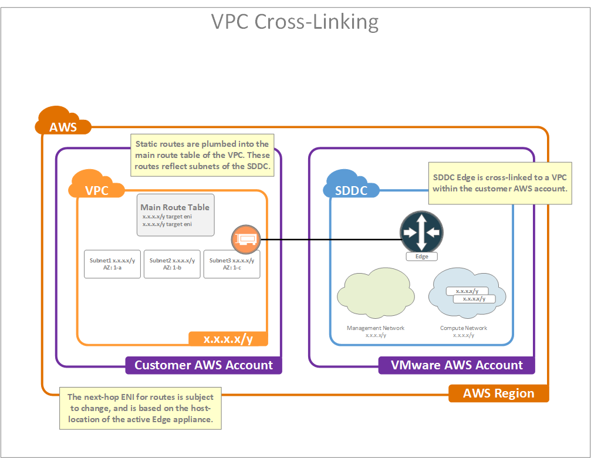
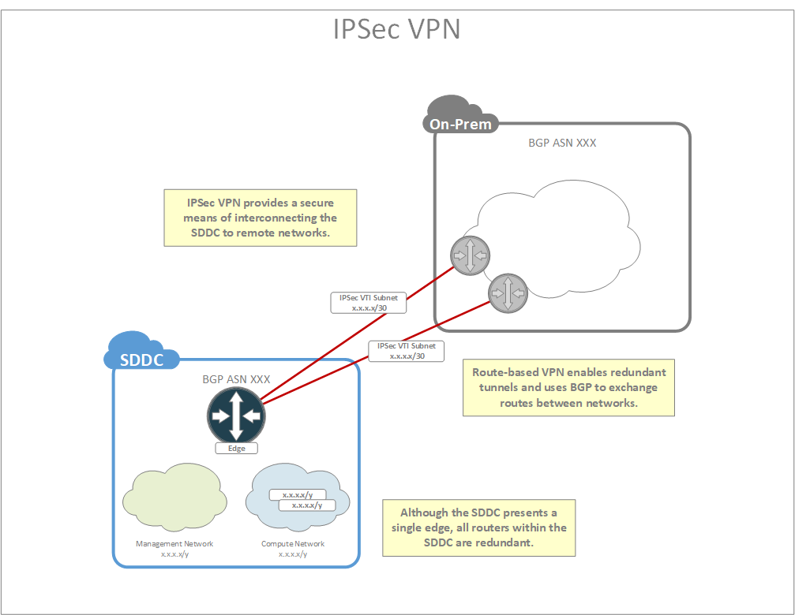
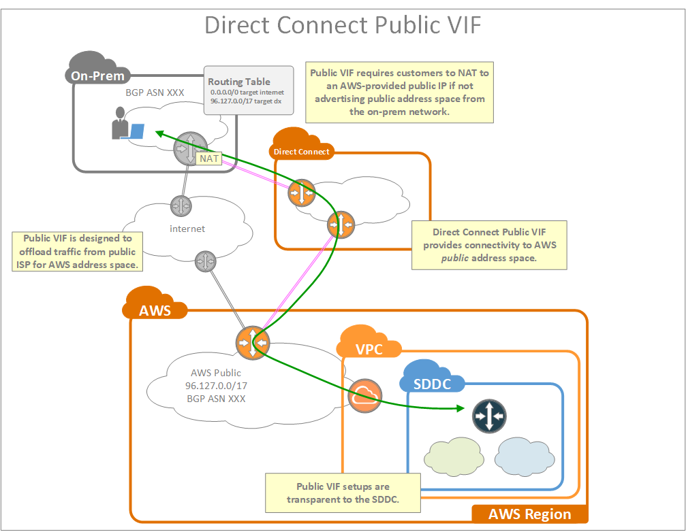
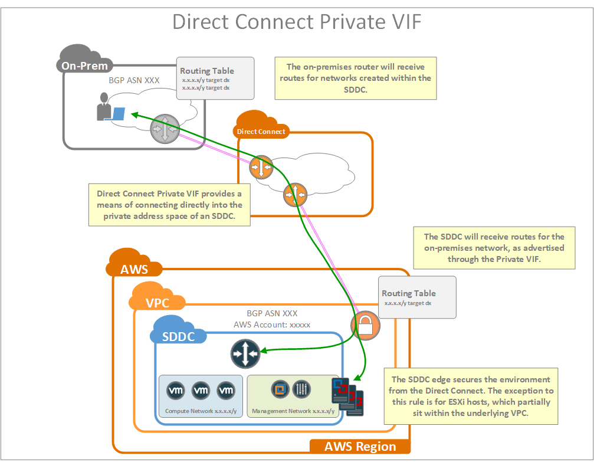

# SDDC Interconnectivity

### The Importance of Proper IP Administration
At minimum, each SDDC will be cross-linked to a VPC within the customer's AWS account. Typically, however, it will also be connected to other networks as well (such as an on-premises environment). In order to ensure that the SDDC can communicate with other interconnect networks, it is vital that IP addressing be properly planned.
 IP ranges should be unique and non-overlapping between the SDDC and any networks to which it will be connected.
 As such, one of the most critical pieces of the design process is proper planning of IP address usage.

Though not required, it is a good practice to allocate IP address space in large, contiguous chunks. The following table provides an example IP Administration plan.

Supernet     | Subnet1      | Subnet2      | Description
-------------|--------------|--------------|------------
10.1.0.0/19  |              |              | on-premises networks
10.1.32.0/19 |              |              | AWS native
10.1.32.0/19 | 10.1.32.0/22 |              | AWS Services VPC
10.1.32.0/19 | 10.1.32.0/22 | 10.1.32.0/26 | AWS Services VPC SDDC x-link
10.1.64.0/19 |              |              | SDDC1
10.1.64.0/19 | 10.1.64.0/20 |              | SDDC1 Management
10.1.64.0/19 | 10.1.80.0/20 |              | SDDC1 Compute
10.1.64.0/19 | 10.1.80.0/20 | 10.1.80.0/24 | SDDC1 Compute Servers

### VPC Cross-Linking
As mentioned previously, SDDCs are given access to AWS services by cross-linking them to a VPC within a customer-owned AWS account. As indicated by the diagram, cross-linking is made possible by ENIs which have been attached to a dedicated subnet within that VPC.

It should be noted that the first cluster of the SDDC will be deployed within the same availability zone as the cross-link subnet.
 This is done in order to avoid cross-AZ bandwidth charges between the edge and the cross-link subnet itself.
 However, keep in mind that if the SDDC communicates with Subnets in other availability zones, then cross-AZ bandwidth charges will be incurred by the customer-owned AWS account.

Routing between the SDDC and the VPC is enabled by using static routes which are created on-demand as networks are added to the SDDC.
 These static routes are added to the main routing table of the customer VPC, and use one of the cross-link ENI as the next-hop for the route.
 It is important to keep in mind that the next-hop ENI used for the static routes will always be that of the ESXi host which houses the active edge of the SDDC.
 This means that if the edge were to migrate to a different host (as happens during a failover event or whenever the SDDC is upgraded) then the next-hop of the static routes will be updated to reflect this change.

### IPSec VPN
In the majority of setups, customers wish to maintain some sort of permanent means of direct connectivity between the SDDC and their on-prem environment.
 While options for permanent connectivity include IPSec VPN and AWS Direct Connect, for the purposes of this discussion, we’ll focus on IPSec VPN.

IPSec VPN provides secure connectivity to the private IP address ranges of the SDDC, and is implemented with a tunnel to the edge router.
There are 2 flavors of IPSec VPN available: policy-based VPN, and route-based VPN.

Policy-based VPN is typically the easiest solution to implement, but requires that the network administrator manually configure the tunnel to permit specific source and destination IP ranges through.
 From a routing perspective, policy-based VPN is akin to managing static routes on your network.
 While it is possible to configure redundant tunnels with policy-based VPN, there is no ability to automatically fail over between tunnels.

Route-based VPN is a bit more complex, involving the creation of virtual tunnel interfaces and BGP routing configurations, but is also much more flexible.
 With route-based VPN, you can create multiple, redundant tunnels and have BGP routing automatically fail over between them when needed.
 An additional benefit is that routing is dynamic, meaning that there is no need to manually adjust the IPSec configuration every time networks are added or removed from the SDDC.

One note on redundancy. 
It the diagram we see 2 physical routers which are providing redundancy to the on-prem side of the connection, but both are terminating to the same edge within the SDDC.
 Although it isn’t obvious at first glance, the SDDC is providing redundancy as well; although at a lower layer.
 In the case of the SDDC, the edge is a distributed router which is implemented across redundant appliances which reside on separate hosts of the SDDC.
 In the event of a failure of the primary appliance, the edge router function will activate on the secondary appliance.
 This redundancy mechanism is built directly into NSX and allows edge routers to failover transparently when needed.

### Direct Connect
Under normal circumstances, customers will access their SDDC via the public internet; either directly to VM public IP addresses, or to private addresses via IPSec VPN. Often times, however, customers wish to avoid using their public internet provider for connectivity to the SDDC. For these cases, AWS offers [Direct Connect](https://docs.aws.amazon.com/directconnect/latest/UserGuide/Welcome.html), which provides direct connectivity into an AWS region via private leased lines.
 With Direct Connect, users will define virtual interfaces ([VIF](https://docs.aws.amazon.com/directconnect/latest/UserGuide/WorkingWithVirtualInterfaces.html)) which allow them to connect to public or private resources within that Region.
 These VIFs come in 2 flavors: Public and Private.
 

Public VIF enables the Direct Connect to be used for accessing the AWS public network.
 When Public VIF is used, the Direct Connect will become the preferred path for reaching AWS public IP addresses.
 This means that if IPSec VPN is being used to access the SDDC, then it will ride over the Direct Connect.


Private VIF, on the other hand, enables Direct Connect to be used for accessing the private IP address space of a VPC.
 When a Private VIF is associated to an SDDC, then it becomes possible to access the SDDC directly without the need for IPSec VPN.

Lets explore this in more detail.

#### Public VIF
Public VIF enables a Direct Connect to be used for accessing the public IP address space of  the AWS network.
 Let's look into the details of how this is implemented.

Normally, customers will have one or more public internet circuits over which they will receive either default routes, or specific BGP prefixes.
 These circuits are used to access the public IP address space which AWS advertises to its upstream internet providers.
 In this example, the on-prem router is receiving a default route to the internet.



When Direct Connect is enabled, and a Public VIF created, AWS will begin to announce all of their public IP prefixes, via BGP, over the Direct Connect.
 In this example, due to the specific routes being advertised by AWS, the customer network will prefer the Direct Connect as its path toward AWS public address space.
 This effectively means that the Direct Connect will be used when connecting to the public IP addresses allocated to the SDDC; 
for example, the public interface of the edge or the Elastic IP of vCenter.

One important consideration when using Public VIF is to keep in mind that the on-prem network must also be reachable via its own public IP address space.
 For larger customers with their own public IP ranges and BGP ASN, they may choose to advertise this address space to AWS over the Direct Connect. 
Doing so will ensure that routing between the customer on-prem environment and AWS is symmetrical, and rides exclusively over the Direct Connect.
 However, the average AWS customer either does not have their own BGP ASN and public IP ranges, or does not want to advertise them over the Direct Connect.
 

For these cases, customers may submit a request to AWS for a public IP. 
AWS will then allocate an IP, from their own public address space, which may be used by the customer for their end of the connection.
 It is important to note that in these cases customers must set up NAT such that all traffic originating from their end, which uses the Public VIF, is NAT-ted to that public IP.
 A common mistake is to forget to configure NAT, and in these cases customers will end up routing traffic into the AWS public network which is sourced from their internal private IPs.
 In this scenario, AWS will drop the traffic, and the end result will be that AWS public address space will be unreachable from the customer environment.

#### Private VIF
The standard means of accessing the private address space of an SDDC is via IPSec VPN.
 This VPN creates a secure virtual tunnel directly between the customer on-prem and the SDDC, either over the public internet or atop Direct Connect Public VIF.
 Direct Connect Private VIF provides an alternative to IPSec VPN by enabling a direct routed path between the customer on-prem network and a VPC within the AWS environment.

As mentioned previously, each SDDC resides within a dedicated VPC which is owned by a master VMware account. 
Because the SDDC resides within a VPC, it is possible to terminate Direct Connect Private VIF directly to that VPC.
 In order to use Direct Connect with an SDDC, **customers must specifically link the Private VIF to the VMware AWS account used by the SDDC**.
 This account information is documented within the Network & Security tab of the SDDC within the VMC console.

Once the VIF has been terminated, the SDDC begins advertising routes through the Private VIF, via BGP.
 The customer on-prem router should also be configured to advertise routes representing the customer private address space, to the SDDC.
 As a general rule, the best practice is to advertise specific routes into the Direct Connect from the on-premises network instead of advertising a default route.

As seen in the diagram, the edge routers of the SDDC are in-path for Direct Connect. 
This means that gateway firewalls are enforcing security, and that the security policies of the SDDC must be configured to permit connectivity to and from the on-prem environment.
 
There is one important exception to this rule, however. 
Due to the fact that the ESXi hosts themselves reside at the base-layer of the infrastructure, 2 of their interfaces are directly connected to Subnets of the underlying VPC.
 Specifically, the management and vMotion interfaces.
 For these interfaces, the path through the Direct Connect will bypass the edge routers of the SDDC.
 This means that security between the on-prem network and the ESXi hosts must be enforced on the on-prem side of the Direct Connect.
 Again, this scenario only applies to Direct Connect Private VIF and does not apply to users of IPSec VPN.

#### [Top](./README.md) | [Back <- SDDC Networking](./03_sddcNetworking.md)
